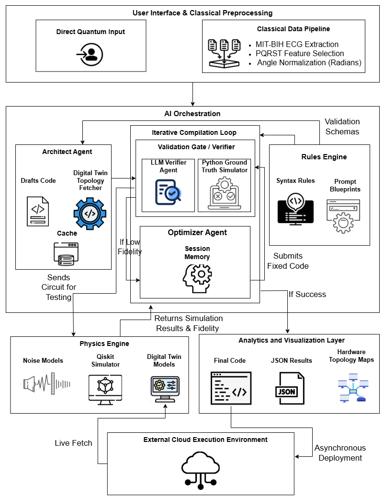
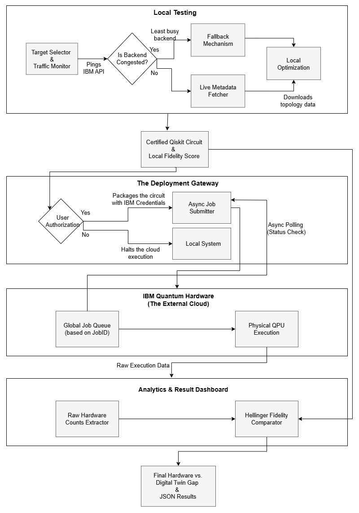
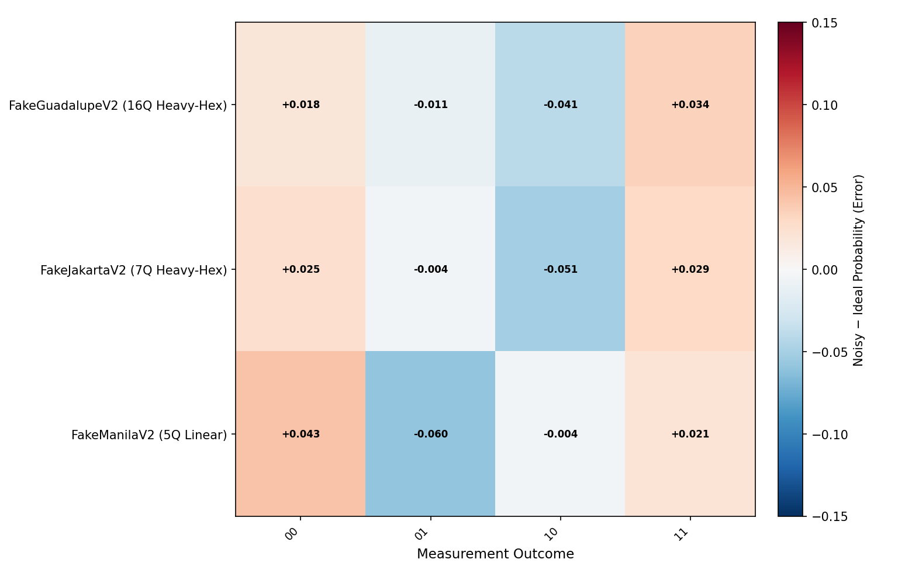

# Q-Optima: Autonomous Multi-Agent Framework for Hardware-Aware Quantum Compilation

A fully autonomous, multi-agent AI framework designed for hardware-aware quantum circuit compilation and dynamic error mitigation. This repository contains the complete open-source implementation used in our research, bridging the gap between abstract quantum logic and the restrictive, error-prone realities of Noisy Intermediate-Scale Quantum (NISQ) physical hardware.

## Overview

Traditional quantum compilers typically rely on static, noise-inducing SWAP gates to force abstract logical circuits onto incompatible hardware topologies, significantly amplifying physical error rates. Q-Optima addresses this critical bottleneck by replacing rigid, one-pass compilation with an intelligent, self-healing closed loop where the initial circuit drafted by Architect Agent based on hardware constraints is refined by the Verifier and Optimizer Agents.

**Core Framework Features:**
* **AI Orchestration Layer:** Specialized LLM agents (Architect, Verifier, Optimizer) orchestrating the compilation loop with ultra-low latency.
* **Hardware-Aware Routing:** Zero-SWAP or minimal-SWAP topological mapping tailored for IBM's linear and heavy-hex physical architectures.
* **Iterative Self-Healing:** Autonomous detection and mathematical repair of logical routing errors using Session Memory and feedback loops.
* **Hybrid Cloud Pipeline:** "Live Fetch" mechanism for real-time calibration metadata (T1, T2, readout errors) to generate Local Digital Twins before asynchronous cloud deployment, minimizing physical error rates and preventing the waste of valuable cloud execution tokens.
* **Biomedical QML Integration:** Automated classical-to-quantum pipelines for encoding MIT-BIH clinical ECG data into parameterized ZZ Feature Maps. This demonstrates the framework's ability to securely preserve complex data in a quantum superposition without hardware noise destroying the patient data distribution.

---

## System Architecture



*(Above: The multi-agent system architecture of the Q-Optima framework, illustrating the interaction between the Architect, Verifier, and Optimizer agents driven by the central Rules Engine).*



*(Above: The Hybrid Cloud Integration pipeline, demonstrating the local optimization feedback loop against Live Digital Twins and the asynchronous deployment to physical IBM hardware after obtaining the required fidelity).*

---

## Repository Structure

```text
Q-Optima/
│
├── docs/                                       # Project documentation and schemas
├── images/                                     # Architecture diagrams and performance charts
├── src/                                        # Core AI agents and orchestration logic
├── static/                                     # Static assets and rule engine blueprints
├── tools/                                      # Utilities for ECG feature extraction and signal processing
│
├── api.py                                      # LLM API routing and configuration
├── braket_connector.py                         # AWS Braket integration (Cross-platform support)
├── ibm_connector.py                            # Live Fetch and IBM Cloud asynchronous deployment
├── main.py                                     # Main entry point for the Q-Optima execution pipeline
├── requirements.txt                            # Python dependencies required for the framework
├── test_fidelity_fix.py                        # Standalone script to test the Optimizer Agent's self-healing
├── test_hardware_fetch.py                      # Standalone script to test the IBM Live Fetch capabilities
├── verify_routing.py                           # Standalone script to test Architect topological mapping
│
├── results/                                    # Auto-generated: JSON logs and execution metrics
└── visualizations/                             # Auto-generated: Circuit diagrams and Bloch spheres
└── README.md
```

---

## Installation & Requirements

### System Requirements

* **OS:** Windows, macOS, or Linux
* **Software:** Python 3.10+ (Required for modern Qiskit and multi-agent library compatibility)
* **API Keys Required:** IBM Quantum Token, Groq API Key (for LLM inference)

### Step-by-Step Installation

**1. Clone the repository**

```bash
git clone [https://github.com/yourusername/Q-Optima.git](https://github.com/yourusername/Q-Optima.git)
cd Q-Optima
```

**2. Install Python Dependencies**

```bash
pip install -r requirements.txt
```
*(Core dependencies include qiskit, qiskit-ibm-runtime, crewai, langchain, groq, wfdb, scipy, and numpy).*

**3. Configure Environment Variables**

Create a `.env` file in the root directory and add your secure credentials:

```bash
GROQ_API_KEY=your_groq_api_key_here
IBM_QUANTUM_TOKEN=your_ibm_token_here
```

---

## Usage Guide

### 1. Run the Full Q-Optima Pipeline

Executes the main multi-agent orchestration. The system will prompt you for the target algorithm or clinical data encoding which is either tested using local models and also optimizes the circuit locally against a live Digital Twin after creating a local copy, triggering the Hybrid Cloud Pipeline.

```bash
python main.py
```

*(Upon successful execution, final output logs, topology maps, and fidelity metrics are automatically saved to the `/results` and `/visualizations` directories).*

### 2. Test Hardware "Live Fetch"

Pings the IBM Quantum API to securely download real-time backend metadata (e.g., from `ibm_brisbane` or `ibm_fez`) and constructs the Local Digital Twin.

```bash
python test_hardware_fetch.py
```

### 3. Verify Autonomous Routing & Repair

Triggers the Verifier and Optimizer agents directly to test the self-healing closed loop on a heavily restricted topology.

```bash
python test_fidelity_fix.py
```

---

## Dataset Availability

The clinical dataset utilized for the ZZ Feature Map encoding case study is the MIT-BIH Arrhythmia Database, which is publicly available via PhysioNet: https://physionet.org/content/mitdb/1.0.0/.

*Note: The `tools/` directory contains scripts that automatically parse `.dat`, `.hea`, and `.atr` files to extract the PQRST features for quantum parameterization.*

---

## Performance Results

Empirical validations confirm that Q-Optima successfully bypasses SWAP-gate limitations on restrictive topologies, achieving a high physical execution fidelity on live IBM Quantum hardware also provides low hardware degradation gap.

### Clinical Data Encoding Noise Resilience



*(Above: Absolute Error Heatmap for clinical ECG data encoded into a quantum superposition. The visualization shows how hardware-aware routing successfully suppresses noise deviations across measurement outcomes).*

---

## License

This project is licensed under the MIT License.

```
MIT License

Copyright (c) 2026

Permission is hereby granted, free of charge, to any person obtaining a copy
of this software and associated documentation files (the "Software"), to deal
in the Software without restriction, including without limitation the rights
to use, copy, modify, merge, publish, distribute, sublicense, and/or sell
copies of the Software, and to permit persons to whom the Software is
furnished to do so, subject to the following conditions:

The above copyright notice and this permission notice shall be included in all
copies or substantial portions of the Software.

THE SOFTWARE IS PROVIDED "AS IS", WITHOUT WARRANTY OF ANY KIND, EXPRESS OR
IMPLIED, INCLUDING BUT NOT LIMITED TO THE WARRANTIES OF MERCHANTABILITY,
FITNESS FOR A PARTICULAR PURPOSE AND NONINFRINGEMENT. IN NO EVENT SHALL THE
AUTHORS OR COPYRIGHT HOLDERS BE LIABLE FOR ANY CLAIM, DAMAGES OR OTHER
LIABILITY, WHETHER IN AN ACTION OF CONTRACT, TORT OR OTHERWISE, ARISING FROM,
OUT OF OR IN CONNECTION WITH THE SOFTWARE OR THE USE OR OTHER DEALINGS IN THE
SOFTWARE.
```

